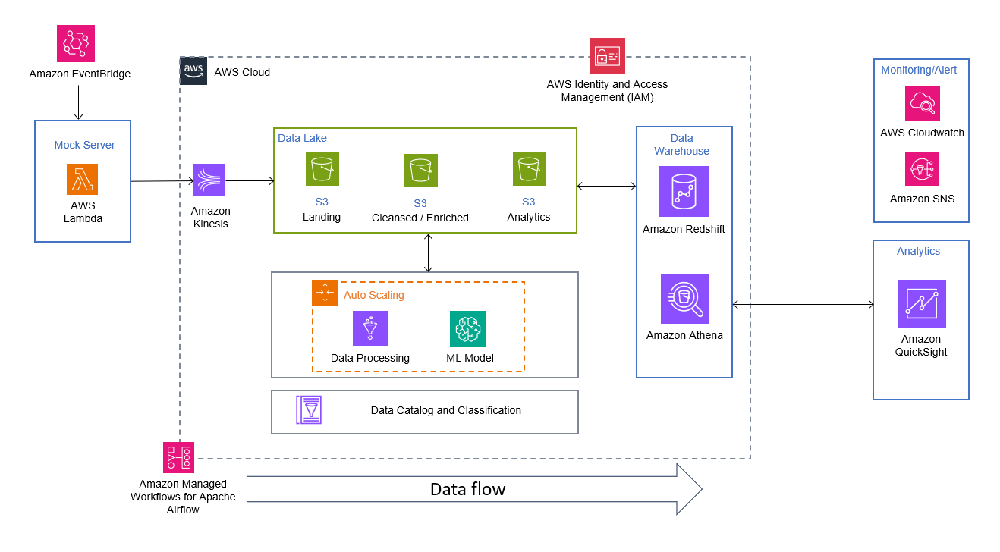
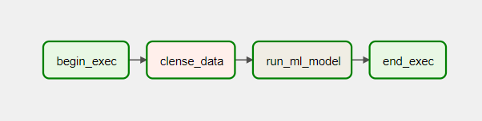

# End to End Data Pipeline and Sentiment Analysis

An End to End data pipeline that could do sentiment analysis on social media data. The pipeline includes an AI model pipeline in order to perform sentiment analysis.

The system is highly scalable.

## Assigment Question

Design a system that combines a storage solution for social media data with Apache Spark for data processing and storage. The system should efficiently handle large volumes of social media data, including comments, posts, user profiles, and interactions. Additionally, incorporate a mock server that continuously adds data to the database at regular intervals. The system should also include an AI model pipeline to perform analysis and generate insights based on the social media data.

## Architecture

## Used Tools/Services

- AWS Lambda
- AWS Glue
- Pyspark, Boto3, Pands, Numpy
- Amazon Kinesis
- S3 Bucket
- AWS Sagemaker
- Amazon Redshift
- Amazon Athena
- AWS Cloudwatch
- Amazon SNS
- Amazon Eventbridge
- Amazon Managed Workflow for Apache Airflow
- AWS IAM
- Amazon Quicksight

## Workflow

### **Mock Server**
Here AWS Lambda function acts as the Mock server. It will generate social media metadata and feeds the data to the Kinesis stream. The Amazon Eventbridge is scheduled to be running every minute or so.

Once the data is available in the Kinesis Stream it will trigger another lambda, consumer lambda, that will load the data to the S3 bucket.

### **Data Lake**
We will be having 3 S3 buckets ie Landing, Cleansed/Enriched, Analytics. The data format will be JSON, Parquet, and Parquet respectively for these buckets.

    Landing -> Clensed/Enriched -> Analytics

### **Data Processing**
The Glue job will do the data processing. We will be doing basic data cleaning, creating partitions, and loading the data to S3 after repartitioning.

Additionally, we have enabled auto-scaling in Glue. This will ensure the use of workers efficiently.

### **AI model**
We will be doing data preprocessing specifically for the analysis.

    Text Cleaning -> Tokenizing -> Stopwords Removal -> Stemming  

Once the preprocessing is done the model will do the sentiment analysis on the cleansed data. It will find out the polarities of the posts and comments and likewise, the sentiments based on the polarities.

The newly created data frame will then be loaded into the Data warehouse.

Additionally, in the notebook, we plotted the sentiments in a graph and created a word cloud to see the prominent words used in Positive, Negative, and Neutral sentiments.

- **Additional Model**
    - A bigram model is created for predicting the probability of a word in a sequence based on the previous word
    - We trained the data on LogisticRegression model
    - We tuned the hyperparameter using GridSearchCV for better accuracy. 

### **Data Warehouse**
We will be using Amazon Athena and Amazon Redshift as the data warehouse. 

Additionally, the data will be loaded into the Athena using AWS Glue crawlers that will keep an eye on the S3 locations and loads the latest data to the table based the schedule.  

### **Monitoring/Alerts**
We have used Cloudwatch for monitoring the logs and SNS for alerting/notifying via SMS or Emails if there are any anomalies found.

### **Analytics**
We can do the analytics using Amazon Quicksight. We will be able to query through the analyzed data and find insights on the sentiments of the posts and comments. 

### **Orchestration**

The entire orchestration is done using Apache Airflow.

